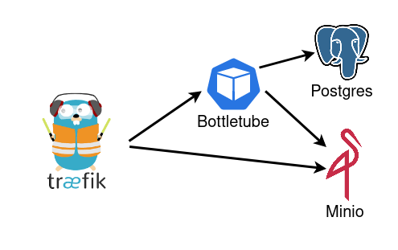

# Dockerize Bottletube

## Description

Bottletube is a service that allows you to manage images in a web application.
Bottletube was originally developed by [Prof. Preuß](https://github.com/thomas-preuss) to teach students the basics of cloud computing on Amazon Web Services (AWS). But for me also a good project to try docker and docker-compose. 
The focus of this project is on learning and not suitable for production environments.

### All I have changed

* Some python code modifications.
* Small changes to the Front-end framework Bootstrap.
* Created a Dockerfile to run the python code locally. 
This was previously running on Amazon Elastic Compute Cloud (EC2) instances. Now use gunicorn as Web Server Gateway Interface. Use uv as package and project manager.  and use distroless for smaller Image.
* Changed used Amazon Simple Storage Service (S3) to a [Minio](https://min.io/).
* Replaced the Amazon Elastic Load Balancer (ELB) with [Traefik](https://traefik.io/traefik/).
* Changed from Amazon Relational Database Service (RDS) to [Postgres](https://www.postgresql.org/).
* created a docker-compose file so that these services can start automatically.
* Secrets that were previously managed using AWS Secrets Manager are now managed using env variable.

### Basic structure

### What I could not change

* I could not transfer the Auto Scaling groups to my new setup. Docker-compose is not able to start new containers on its own. There are other technologies for this, such as [Kubernetes](https://kubernetes.io/).
* I was also unable to implement the Amazon CloudFront in this project. The development of a content delivery network (CDN) also requires many distributed data centres that cannot be realised here.

## Setup

To start the project, `docker` and `docker-compose` are required. The installation instructions can be found [here](https://docs.docker.com/get-docker/).

1. The whole setup can be started with the following command:`docker compose --env-file .env.dev up`
2. It can then be opened in the browser: `firefox http://bottletube.localhost`